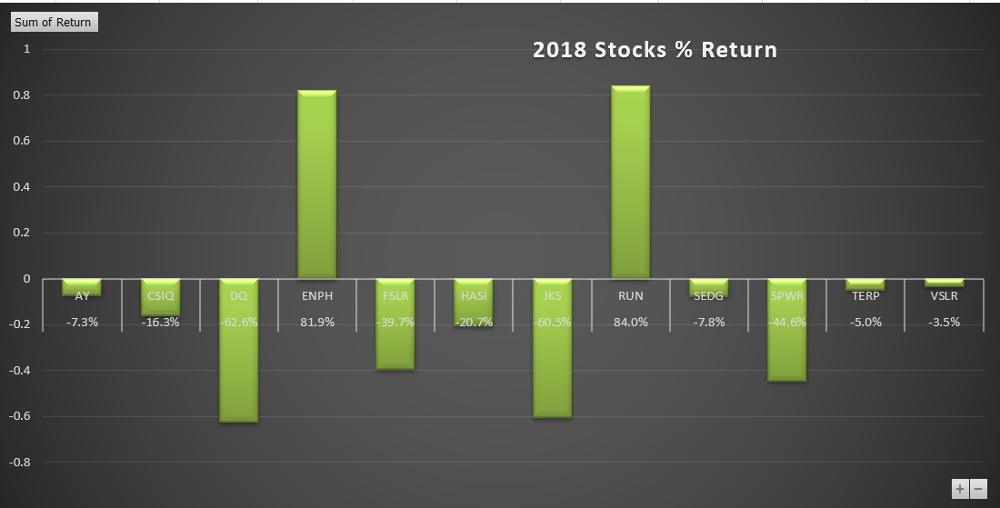

# VBA Of Wall Street: Alternative Energy Analysis

## Project Overview

#### Steve's parents are interested in investing in Green Energy stocks, the purpose of our analysis is to go through 12 different stocks, for the years 2017 and 2018 and provide them with enough information to make their decision. They are specifically interested in DACO "DQ" stock. To do so, we are going to create a code on VBA from which we will get all of the needed information.
#### We are also going to compare how fast the code generates the results, before and after refactoring it.

## Stock Analysis Results

#### From the pictures attached below, we notice that 2017 was a great year for Green Energy stocks' returns. In fact, all of the stocks, except "TERP" had a positive return, "DQ" had the best increase in return, with 199.4% increase. So, looking at these numbers, we can definitely understand why Steve's parents were interested in investing in "DQ" stock, beside the fact that they had first met at a Dairy Queen.
#### However, in 2018, all of the stocks had negative return, and only 2 out of 12 stocks saw positive returns. Unfortunately "DQ" was hit with the most decline in return, 62.6%.

     

       

## Speed of code's results

#### Prior to refactoring the code, the script run times for 2017 and 2018 were 0.66779688 seconds and 0.6601563 seconds, respectively. After refactoring, the results for 2017 and 2018 were generated in 0.1015625 seconds and 0.140625 seconds respectively. This is a time reduction by about 5 to 6 times.
 

          

            

## What are the advantages or disadvantages of refactoring code?

#### When we refactored our code, we didn't make any changes to it, our results are still similar. However, we helped organize it a little better by making each step clearer, easier to understand, and easier for the code to run. For instance, the use of the TickerIndex, and creating the output arrays for each ticker volume, ticker starting price and ticker ending price helped us write our code more efficiently, which positively helped generate the results faster.
#### I am not sure there are disadvantages to refactoring a code, it actually helps the code writers organize their thoughts, improve their presentation to make the code easier to read by other people, and also have the code provide results in a faster time frame. The only challenge maybe was to understand the logic behind the instructions, such as creating the tickerindex as a variable and whatnot.

## How do these pros and cons apply to refactoring the original VBA script?

#### In our case when we refactored the code, we were able to get results around 5X times faster than prior. We also have comment before each command to explain our steps and their purpose. 
#### Maybe we didn't notice the time difference much due to the amount of data we have, but imagine if we have to run another analysis utilizing a larger dataset? We would definitely notice that our code is slow at running the results we'd like, and maybe it wouldn't look as organized and efficient as we would hope. 
